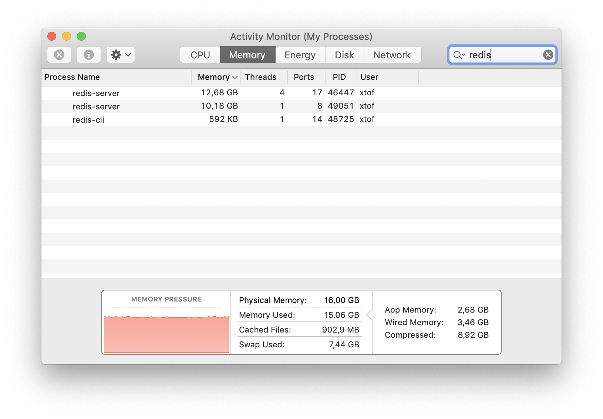
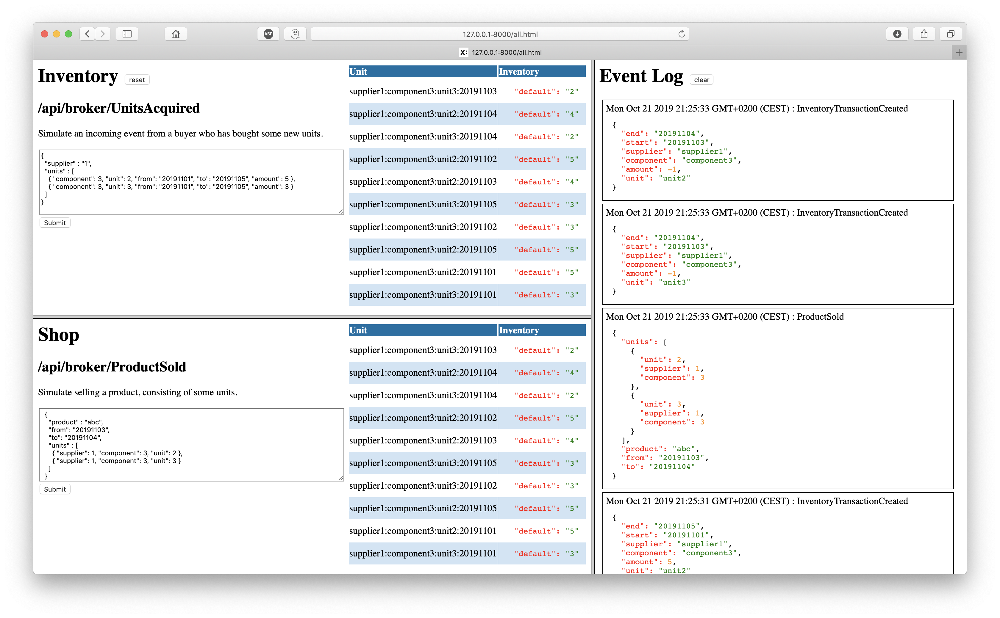

# iv8

> proof of concept of a light weight, high volume inventory tracking event-driven service

## Prerequisites

- Redis (e.g. brew install redis; redis-server /usr/local/etc/redis.conf)
- Python 3

```bash
$ git clone https://github.com/christophevg/iv8
$ cd iv8
$ virtualenv -p python3 venv
$ . venv/bin/activate
(venv) $ pip install -r requirements.txt
```

## Light Weight

The architecture of this setup consists of a Redis backend and a Flask/REST stateless API for accepting and processing incoming events and publishing events due to changes applied to the inventory.

We track the inventory of units over days. A unit is a structural atomic part of a component. Different suppliers can provide the same units. The inventory of a unit can be partitioned.

An inventory entry will therefore look like this in Redis:

```redis
127.0.0.1:6379> hgetall supplier1:component1234:unit6:20191225
 1) "partition3"
 2) "3"
 3) "partition9"
 4) "8"
 5) "partition8"
 6) "7"
 7) "partition2"
 8) "8"
 9) "partition1"
10) "4"
11) "partition5"
12) "2"
13) "partition0"
14) "7"
15) "partition4"
16) "5"
17) "partition7"
18) "1"
19) "partition6"
20) "2"
```

The key consists of a namespace from supplier, over component and unit to the date in YYYYMMDD format. The value stored is a hash with values for each partition.

## High Volume

I wanted to know if tracking inventory for 2 suppliers, 2500 components each with 10 units over 1000 days with 10 paritions would be feasible.

This would result in 2 * 2500 * 10 * 1000 = 50 million keys being mapped to hashes of 10 key/value pairs.

`iv8/inventory/populate.py` is a straigthforward script to load this into a Redis store:

```bash
(venv) $ time python iv8/inventory/populate.py 
0
1
2
3
4
5
...
2497
2498
2499

real  88m50.253s
user  55m42.982s
sys   0m35.768s
```

### Speed

It took roughly 89 minutes to load the 50M entries, which boils down to roughly 106,8 us per entry, or 2,136 seconds per component (e.g. * 1000 days * 10 units * 2 suppliers). Only the first 5 entries took 7,414 seconds, or 1,482 seconds.

So towards the end of the loading, things did clearly slow down. This was clearly due to the increase in size that needed to be persisted.

Towards the beginning it took less that a second:

```
46447:M 19 Oct 2019 11:32:20.101 * Background saving started by pid 48192
48192:C 19 Oct 2019 11:32:20.323 * DB saved on disk
```

At the end it took over a minute to do this.

```
46447:M 19 Oct 2019 12:20:57.088 * Background saving started by pid 48699
48699:C 19 Oct 2019 12:22:18.883 * DB saved on disk
```

During saving time, loading was often slowed down up to a complete halt.

### Size

Given roughly 40bytes for a key and 110bytes for a value, this represents about 7.5 GB of data. After loading all data, my OS reported:

```bash
$ ps -o rss,vsz `pgrep redis-server`
   RSS      VSZ
  1272 17662724
```



On disk things looked like this:

```bash
$ redis-cli config get dir
1) "dir"
2) "/usr/local/var/db/redis"
$ cd /usr/local/var/db/redis/
$ du -sh
5.8G	.
$ ls -l
total 12191072
-rw-r--r--  1 xtof  admin  4982418920 Oct 19 12:41 dump.rdb
-rw-r--r--  1 xtof  admin  1246049351 Oct 19 13:22 temp-49051.rdb
```

For pretty some time after the loading was done, Redis was still saving the data to a new dump file. But even with this double storage the total storage of data didn't even reach the theoretical 7.5G.

So in general, given my simple MacBook with 16GB of memory, a stock Redis, these volume requirements are no real issue for Redis, even when it was clearly pushing the limits of my machine ;-)

## Let's Get Interactive

You can run an interactive web-based application from the checked out repository:

```bash
(venv) $ gunicorn -w 1 -k eventlet iv8:server
```

> Pro-Tip: there is also a top-level `Makefile`, allowing for a simple `make` command, generating and loading the environment all-in-one-go for you.

Or alternatively, you can deploy it to [Heroku](https://heroku.com) and play with it over there. Mind that the free Redis store is only 25MB, so loading 2500 components won't be possible ;-)

[](https://heroku.com/deploy)

### All in One

From the index page, you'll want to go to the `all.html` page, which after some toying around might end up to look like this:


